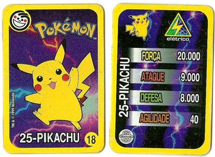
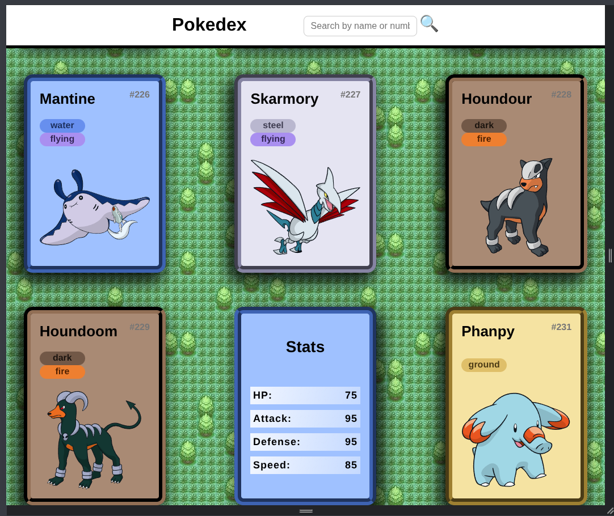
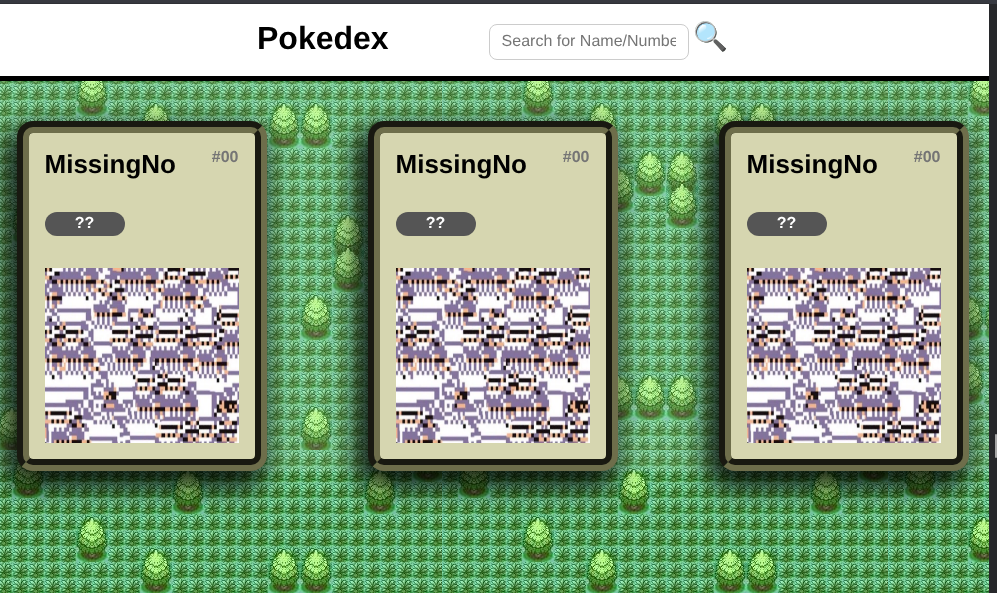
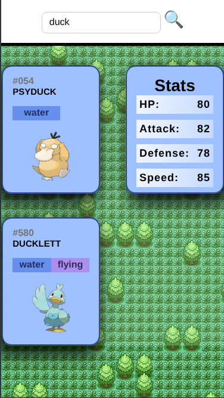

# Pokédex Web App

This is a cool Pokédex web application built using **HTML**, **CSS**, and **JavaScript**.  

I based the individual cards on some real pokemon cards from my childhood. They had stats on the back.

 

 
 

If one day the PokéAPI happens to not work properly, you’ll be able to see MissingNo (and the proper error message in the log).

 

 

Of course, it's fully responsive

 

---

Test it out here 👉🔗 https://diolemos.github.io/Pokedex/
   

##  Features

- 🔁 **Flip card animation** to view Pokémon stats
- 🔍 **Search bar** with debounced input that filters against a local JSON list of all Pokémon names and IDs, then fetches detailed data on demand
- ⬇️ **Infinite scroll** to load more Pokémon as you scroll
- 🧩 **CSS Modules** and **JS Modules** for better organization
- 🧠 Applied **DRY (Don't Repeat Yourself)** and **Single Responsibility** principles
- 🎨 **CSS variables** for type-based styling
- 📦 **Pokemon class** abstraction to simplify data handling from the PokéAPI (as taught in the DIO lesson)
- ❌ **Robust error handling** with a custom fallback **MissingNo card** for missing or invalid Pokémon data
- 🖼️ Switched to **official-artwork** sprites for improved image coverage

---

## Boring Stuff 😪💤

- Structured with **modular and reusable components**
- Applies **object-oriented JavaScript** (via a `Pokemon` class)
- Uses **REST API integration** with data transformation (PokéAPI)
- Local JSON list of all Pokémon (ID + name) to enable **fuzzy, partial search** without overloading the API
- Implements **debounced API calls** on search to optimize performance and reduce network usage
- Handles missing data gracefully with a dedicated **MissingNo fallback card**
- Organized following **Single Responsibility** and **DRY** principles
- Implements **flip-card animations** with clean CSS
- Features a **search bar** with real-time filtering and debounced input
- Includes **infinite scroll** for dynamic content loading
- Styled with **CSS variables** for flexible, type-based theming
- Built using **CSS and JavaScript modules** for maintainability
---

## 🛠 Technologies

- HTML5
- CSS3
- JavaScript (ES6+)
- PokéAPI (https://pokeapi.co/)

---
